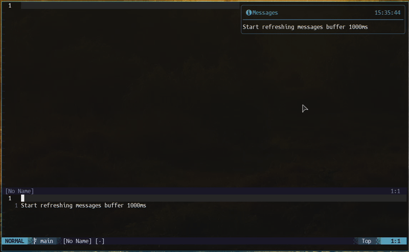

<div align="center">

# Auto Refresh Messages

Refresh Neovim Message buffer automatically.

[](http://www.lua.org)
[](https://neovim.io)

</div>

## Description

This is a very simple plugin for [Neovim](https://neovim.io) that opens the Neovim's [Message buffer](https://neovim.io/doc/user/message.html) and refreshes it automatically.

## Usage

```lua
local refresh = require('auto-refresh-messages')

refresh.setup({
  interval = 1000,    -- Refresh interval in milliseconds
  silent = false,     -- Set "true" to disable messages when starting/stopping
})

refresh.start     -- Start auto-refresh
refresh.stop      -- Stop auto-refresh
refresh.toggle    -- Toggle auto-refresh on/off
```

### Installation & Configuration

- Using [lazy](https://github.com/folke/lazy.nvim):

```lua
return {
  'jkallio/auto-refresh-messages.nvim',
  config = function()
    local refresh = require('auto-refresh-messages')

    -- Setup auto-refresh
    refresh.setup({
      interval = 1000, -- Refresh interval in milliseconds
      silent = false,  -- Do not show messages when starting/stopping
    })

    -- Set keymap for toggling auto-refresh on/off
    vim.keymap.set("n", "<leader>M", refresh.toggle, { silent = true, desc = "Toggle auto-refresh messages" })
  end
}
```

### Screenshots


